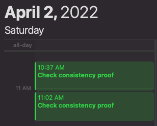

# org2cal
Converts LOGBOOK entries in an Emacs org file to iCalendar format

This module reads LOGBOOK entries in an Emacs org file and adds them to the macOS Calendar app.  The LOGBOOK entries record clocked times and can be generated using [org-pomodoro](https://github.com/marcinkoziej/org-pomodoro).

One needs to set up `~/org2calrc` first.  An example is as follows.
```
[DEFAULT]
source = /Users/veggente/inbox.org
output = /Users/veggente/Downloads/cal.ics
```

Running `org2cal -s 2022-4-2 -e 2022-4-2` converts an org entry like
```
* Check consistency proof
  :LOGBOOK:
  CLOCK: [2022-04-02 Sat 11:02]--[2022-04-02 Sat 11:27] =>  0:25
  CLOCK: [2022-04-02 Sat 10:37]--[2022-04-02 Sat 11:02] =>  0:25
  :END:
```
into Calendar events like

